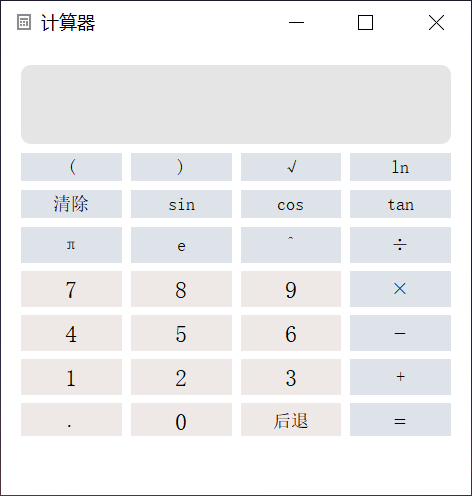
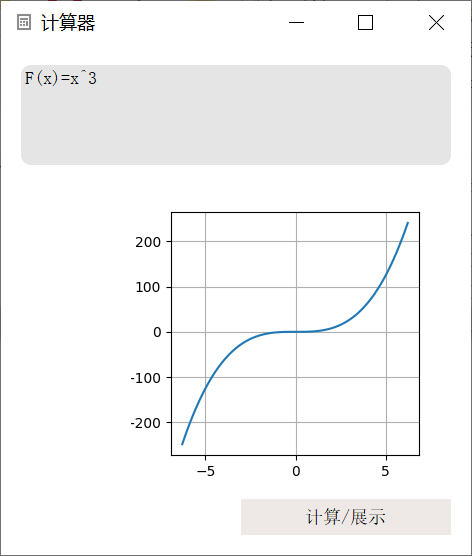
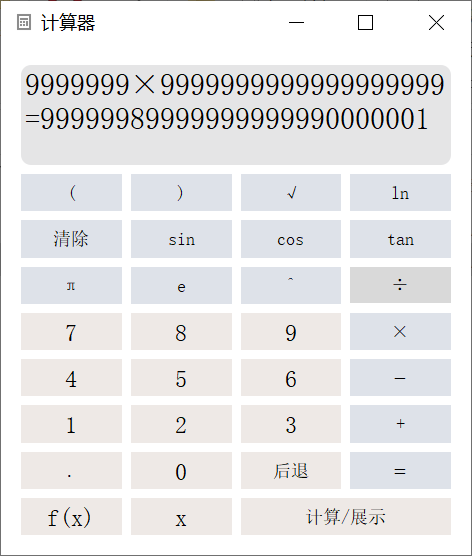

# Calculator

## 版本说明

### version_2

- 包含基本运算功能
- 包含一部分科学计算功能（三角函数、指数、对数等）
- 包含历史记录功能（所有算式及结果将被储存在logging.txt中）

### version_3

- 增加函数图像绘制功能
- 历史记录功能中增添报错记录（所有算式及结果、出错信息将被储存在logging.txt中）

### version_beta_3

- 功能与版本version_3相同，将基本计算功能改用C++代码实现

## 预览

- version_2

  
  
- version_3

  

  

- version_beta_3

  
  

  